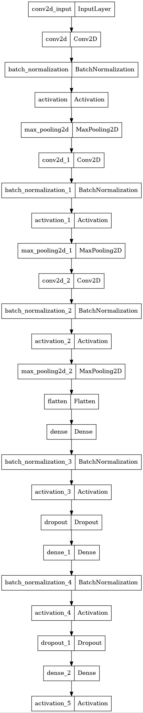

# Google Quick, Draw! Sketch Classifier

This project involves the development of a Convolutional Neural Network (CNN) model designed to classify sketches from Google's "Quick, Draw!" dataset. The project demonstrates the model's capability to achieve a commendable 70% accuracy in identifying a wide array of objects and concepts from the dataset.

&nbsp;&nbsp;
## Overview

Google Quick, Draw! is an AI experiment where players draw objects and a neural network attempts to guess what they are drawing. The dataset consists of 50 million drawings across 345 categories, captured as timestamped vectors. For this project I have already converted the dataset into `.pkl` format and employs a CNN model to classify the sketches.

&nbsp;&nbsp;
## Dataset

The dataset used in this project is the "Quick, Draw!" dataset, which contains 50 million sketches across 345 categories. The data was preprocessed and converted into `.pkl` format for efficient loading and training.

&nbsp;&nbsp;
## Model Architecture

The CNN model is built using Python and TensorFlow, featuring multiple convolutional layers, batch normalization, activation layers, max pooling, fully connected layers, dropout for regularization, and a softmax classifier at the end. The architecture is designed to handle the complexity of the sketch classification task effectively.

&nbsp;&nbsp;

&nbsp;&nbsp;
### Reasoning for Selection of CNN Model and the Architecture

The selection of a Convolutional Neural Network (CNN) model for this project was motivated by the inherent advantages of CNNs in image and pattern recognition tasks. CNNs are particularly effective at capturing spatial hierarchies in images through the use of convolutional layers that apply filters to input data, enabling the model to detect various features such as edges, textures, and shapes. This characteristic makes CNNs well-suited for the classification of sketches, which often contain intricate and variable patterns. The architecture was designed with multiple convolutional layers followed by batch normalization and activation layers to enhance feature learning and ensure stable and faster training. Max pooling layers were incorporated to reduce dimensionality and computational complexity while retaining significant features. Fully connected layers were used towards the end to aggregate these features and enable final classification through a softmax layer. This design aims to balance complexity and performance, making it robust for handling the diverse "Quick, Draw!" dataset.

&nbsp;&nbsp;
## Evaluation Method

The evaluation of the CNN model was carried out using a standard approach that involves making predictions on a test dataset and assessing the model's performance through a classification report. The model was compiled with the Adam optimizer, known for its efficiency and adaptive learning rate, and the categorical cross-entropy loss function, suitable for multi-class classification tasks. The performance metrics included accuracy, providing a direct measure of the model's prediction correctness. Predictions were made on a separate test dataset to evaluate how well the model generalizes to unseen data. The classification report, generated using the `classification_report` function, provided detailed insights into the model's precision, recall, and F1-score for each class, facilitating a comprehensive assessment of the model's performance across all categories in the dataset. This method ensured a rigorous and transparent evaluation of the CNN model's effectiveness in classifying sketches from the "Quick, Draw!" dataset.

&nbsp;&nbsp;
## Usage

1. **Preprocess the Dataset**: Convert the raw dataset into `.pkl` format.

2. **Train the Model**: Run the training script to train the CNN model on the preprocessed dataset.

3. **Evaluate the Model**: Use the evaluation script to test the model's accuracy on a validation set.

4. **Make Predictions**: Utilize the trained model to classify new sketches.

&nbsp;&nbsp;
## Results

The CNN model achieved a 70% accuracy in classifying sketches from the "Quick, Draw!" dataset. This performance demonstrates the model's ability to effectively learn and recognize various sketches.

